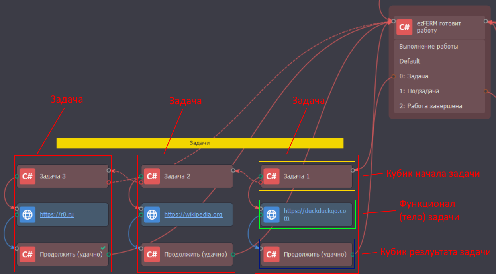
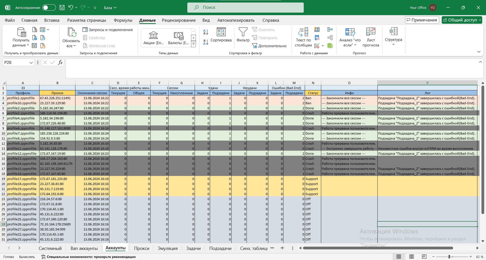
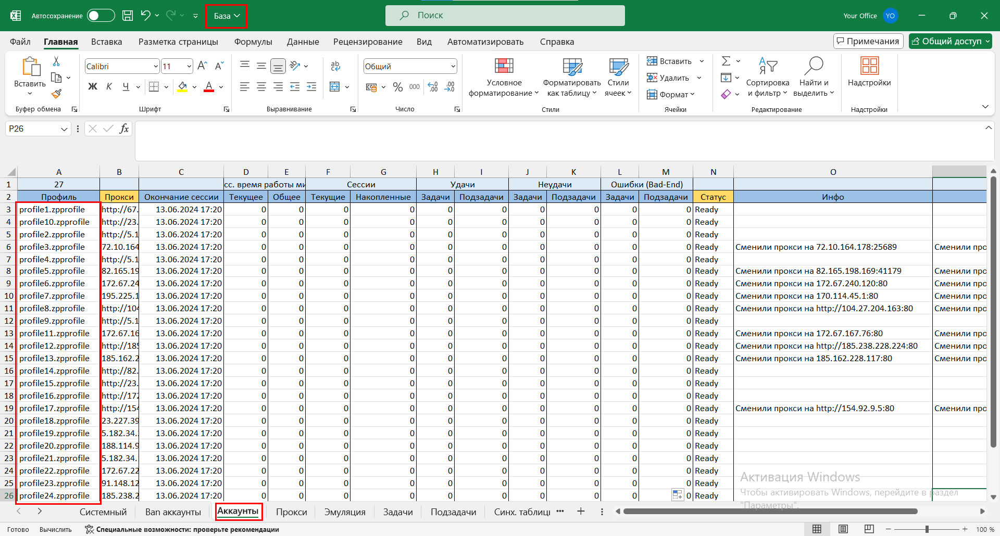

# 🚀 Обзор

## <mark style="color:blue;">Создание ферм</mark>

Создавайте личные фермы мультиаккаунтов без усилий, используя шаблон-создатель ферм, создающий на 100%  подготовленную и оснащенную всем необходимым ферму, для работы с тысячами аккаунтов и выполняющую любой вид работ из сотен задач.



<figure><figcaption></figcaption></figure>



<figure><figcaption></figcaption></figure>



<figure><figcaption></figcaption></figure>



<figure><figcaption></figcaption></figure>



Каждая ферма создается используя одинаковую файловую структуру. Что бы создать новую ферму, нужно просто скопировать всю папку  "Шаблон" в директорию личных ферм.



<figure><figcaption></figcaption></figure>



<figure><figcaption></figcaption></figure>




<figure><figcaption></figcaption></figure>





1. Ферма - это папка с шаблоном по пути "ezFERM/ezFERM - создатель ферм/Шаблон". В папке все базовые файлы от фермы и сам шаблон.
2. После копирования папки, получается новая ферма. Разработка своей фермы всегда начинается с копирования этой папки, потому что в папке уже готовая ферма.
3. После копирования папки, открываете шаблон из папки и добавляете в него свои задачи и подзадачи.


## <mark style="color:blue;">Стандартизация разработки</mark>

Одинаковая файловая структура всех ферм и строгая структура файла проекта делает разработку стандартизированной и предсказуемой, а также ограждает функционал вашей фермы от разрастания в монолитную массу из кубиков и клубков запутанных связей.



<figure><figcaption></figcaption></figure>



<figure><figcaption></figcaption></figure>



<figure><figcaption></figcaption></figure>



<figure><figcaption></figcaption></figure>



## <mark style="color:blue;">Менеджер задач</mark>

Ферма ezFERM создается для выполнения заданной работы в сети интернет (не только), наводняя целевую платформу/сайт большим количеством ботов, выполняющих действия не отличимые от действий реального человека.

Модульная система добавления задач и подзадач, упрощает разработку фермы, ее обслуживание и масштабирование. Появляются возможности:

* Включать и выключать каждую задачу и подзадачу отдельно, добавлять новые или удалять совсем.
* Выбор режимов выполнения: рандомно, по очереди, рандомно до конца, по очереди до конца.
* Распределение количества выполнений каждой задачи и подзадачи.
* Гибко управлять ходом выполнения и результатом каждой задачи/подзадачи: удачно, неудачно, заблокировать задачу/подзадачу, забанить профиль, закончить сессию, закончить все сессии, bad end (ошибка).&#x20;

&#x20; И также многое другое.

## <mark style="color:blue;">Задачи и подзадачи в ProjectMaker</mark>

Для предпочитающих писать кубиками.



<figure><figcaption></figcaption></figure>



<figure><figcaption></figcaption></figure>



## <mark style="color:blue;">Задачи и подзадачи в VisualStudio</mark>

ezFERM будет обращаться в вашу сборку для вызова задач и подзадач. Для продвинутых пользователей, знающих язык программирования C#.&#x20;



<figure><figcaption></figcaption></figure>



<figure><figcaption></figcaption></figure>




## <mark style="color:blue;">Эмуляция жизнедеятельности</mark>

ezFERM расширяет встроенные в ZennoPoster антидетект фишки эмулятором жизнедеятельности. Гибкая настройка поведения аккаунта для максимальной схожести с поведением реального человека.

<figure><figcaption></figcaption></figure>

## <mark style="color:blue;">Прокси менеджер</mark>

Все прокси хранятся в базе прокси, автоматически устанавливаются каждому аккаунту. Во время работы аккаунтов прокси проходят постоянные проверки на доступность, осуществляются баны прокси, замены для бесперебойной работы аккаунтов. Глубоко настраиваемая работа с прокси позволяет настроить проксификацию под себя.&#x20;

## <mark style="color:blue;">База данных Excel</mark>

Для каждой фермы личная база данных, хранящая информацию об аккаунтах, забаненых аккаунтах, прокси, настройках эмулятора, задачах и подзадачах, синхронизированных таблицах. Используется для записи и чтения данных как системой ezFERM, так и пользователем одновременно.



<figure><figcaption></figcaption></figure>



<figure><figcaption></figcaption></figure>



<figure><figcaption></figcaption></figure>



<figure><figcaption></figcaption></figure>



<figure><figcaption></figcaption></figure>



<figure><figcaption></figcaption></figure>



<figure><figcaption></figcaption></figure>



## <mark style="color:blue;">Синхронизированные таблицы</mark>

Лист "Аккаунты" хранит данные об аккаунтах. На каждый аккаунт отдельная строка. Так как лист хранит системную и информацию и добавление своих столбцов не предусмотрено, всегда можно создать таблицы, синхронизированные с ключевым столбцом "Профили". Добавление или удаление аккаунтов будет как в Базе, так и в ваших таблицах.



<figure><figcaption></figcaption></figure>



<figure><figcaption></figcaption></figure>



<figure><figcaption></figcaption></figure>



## <mark style="color:blue;">Логгирование</mark>

Общий лог выполнения и расширенные логи по каждому аккаунту и прокси.



<figure><figcaption></figcaption></figure>



<figure><figcaption></figcaption></figure>



<figure><figcaption></figcaption></figure>



<figure><figcaption></figcaption></figure>



## <mark style="color:blue;">Настройки фермы</mark>

Интерфейс для управления поведением фермы в целом, так и каждой ее части отдельно. Настройки делятся на внутренние, доступные только для разработчику во время проектирования и внешние, доступные как разработчику так и клиенту.

### Внешние



<figure><figcaption></figcaption></figure>



<figure><figcaption></figcaption></figure>



<figure><figcaption></figcaption></figure>



### Внутренние



<figure><figcaption></figcaption></figure>



<figure><figcaption></figcaption></figure>



<figure><figcaption></figcaption></figure>



<figure><figcaption></figcaption></figure>



<figure><figcaption></figcaption></figure>



## <mark style="color:blue;">Инсталлятор среды ezFERM</mark>

Все фермы, создаваемые сообществом, работают в общей среде, устанавливаются и обновляются через единый инсталлятор. Среда - это директория установки ezFERM.&#x20;

<figure><figcaption></figcaption></figure>

Вне этих директорий фермы работать не будут.&#x20;

## <mark style="color:blue;">Монетизируйте создаваемые фермы</mark>&#x20;

Если после создания фермы появится желание ее продать, или сделать публичной, есть возможность вписать ферму в инсталлятор, после чего ваши личные фермы будут автоматически устанавливаться и обновляться по мере доработки у других пользователей в папке "Поставляемые фермы". Также фермы, разрабатываемые другими пользователями и добавленные в единый инсталлятор, будут установлены у вас с автоматическим получением обновлений. Поставляемые фермы активируется уникальными ключами. Система лицензирования, предоставляемая ezFERM в вашем распоряжении.

## <mark style="color:blue;">Прочий функционал</mark>

* Ассистирование разработки. Ферма всегда подскажет, что сделать развернутыми комментариями.
* Настройки многопоточности. Запущенный поток может обслуживать как один аккаунт, так и большое количество без простоев.
* Авто перезапуск после bad end.
* Неограниченное количество создаваемых ферм.
* Одновременная разработка ферм.
* Одновременный запуск ферм.
* Отладка ферм.
