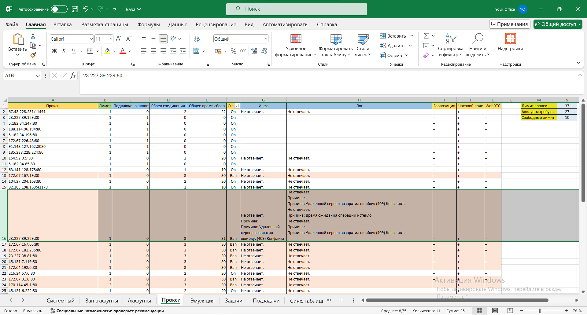

# Обзор

## <mark style="color:blue;">Создание ферм</mark>

Каждая ферма создается используя одинаковую файловую структуру. Что бы создать новую ферму, нужно просто скопировать всю папку  "Шаблон" в директорию личных ферм.



<figure><figcaption></figcaption></figure>



<figure><figcaption></figcaption></figure>



<figure><figcaption></figcaption></figure>



## <mark style="color:blue;">Стандартизация разработки</mark>

Строгая структура файла проекта привносит стандартизацию разработки в сообщество ZennoPoster.&#x20;



<figure><figcaption></figcaption></figure>



<figure><figcaption></figcaption></figure>



<figure><figcaption></figcaption></figure>



## <mark style="color:blue;">Task Manager</mark>

Модульная система добавления задач и подзадач, упрощает обслуживание и масштабирование. Появляется возможность включать и выключать каждую отдельно (без отсоединения от системы), добавлять новые (присоединить) или удалять совсем (отсоединить). Указать в настройках фермы порядок выполнения: рандомно, по очереди, рандомно до конца, по очереди до конца. Распределить количество выполнений каждой задачи и подзадачи. Гибко управлять ходом выполнения и результатом каждой задачи/подзадачи: удачно, неудачно, заблокировать задачу/подзадачу, забанить профиль, закончить сессию, закончить все сессии, bad end (ошибка). И также многое другое.

## <mark style="color:blue;">Задачи и подзадачи в ProjectManager</mark>

Для предпочитающих писать кубиками.



<figure><figcaption></figcaption></figure>



<figure><figcaption></figcaption></figure>



## <mark style="color:blue;">Задачи и подзадачи в VisualStuido</mark>

ezFERM будет обращаться в вашу сборку для вызова задач и подзадач. Для продвинутых пользователей, знающих язык программирования C#.&#x20;



<figure><figcaption></figcaption></figure>



<figure><figcaption></figcaption></figure>




В вашем распоряжении добавление и удаление задач, изменение их функционала. Остальная часть шаблона - это служебная часть.


## <mark style="color:blue;">Эмуляция жизнедеятельности</mark>

ezFERM расширяет встроенные в ZennoPoster антидетект фишки эмулятором жизнедеятельности. Гибкая настройка поведения аккаунта для максимальной схожести с поведением реального человека.

<figure><figcaption></figcaption></figure>

## <mark style="color:blue;">База данных Excel</mark>

База данных фермы, хранящая информацию об аккаунтах, забаненых аккаунтах, прокси, настройках эмулятора, задачах и подзадачах, синхронизированных таблицах. Используется для записи и чтения данных как системой ezFERM, так и пользователем одновременно.



<figure><figcaption></figcaption></figure>



<figure><figcaption></figcaption></figure>



<figure><figcaption></figcaption></figure>



<figure><figcaption></figcaption></figure>



<figure><figcaption></figcaption></figure>



<figure><figcaption></figcaption></figure>



<figure><figcaption></figcaption></figure>



## <mark style="color:blue;">Синхронизированные таблицы</mark>

Лист "Аккаунты" хранит данные об аккаунтах. На каждый аккаунт отдельная строка. Так как лист хранит системную и информацию и добавление своих столбцов не предусмотрено, всегда можно создать таблицы, синхронизированные с ключевым столбцом "Профили". Добавление или удаление аккаунтов будет как в Базе, так и в ваших таблицах.



<figure><figcaption></figcaption></figure>



<figure><figcaption></figcaption></figure>



<figure><figcaption></figcaption></figure>



## <mark style="color:blue;">Логгирование</mark>

Общий лог выполнения и расширенные логи по каждому аккаунту и прокси.



<figure><figcaption></figcaption></figure>



<figure><figcaption></figcaption></figure>



<figure><figcaption></figcaption></figure>



<figure><figcaption></figcaption></figure>



## <mark style="color:blue;">Инсталлятор среды ezFERM</mark>

Все фермы, создаваемые сообществом, работают в общей среде, устанавливаются и обновляются через единый инсталлятор. Среда - это директория установки ezFERM.&#x20;

<figure><figcaption></figcaption></figure>

**Создатель ферм** - материалы шаблона для создания фермы.

**Личные фермы** - папка для разрабатываемых ферм.

**Поставляемые фермы** - фермы других разработчиков.

**Ресурсы** - системные файлы.

Вне этих директорий фермы работать не будут. Если после создания фермы появится желание ее продать, или сделать публичной, есть возможность вписать ферму в инсталлятор, после чего ваши личные фермы будут автоматически устанавливаться у других пользователей, использующих инсталлятор ezFERM. Ваша ферма будет обновляться у всех участников по мере доработки. Также фермы, разрабатываемые другими пользователями и добавленные в единый инсталлятор, будут установлены у вас с автоматическим получением обновлений.

## <mark style="color:blue;">Монетизируйте создаваемые фермы</mark>&#x20;

Если после создания фермы появится желание ее продать, или сделать публичной, есть возможность вписать ферму в инсталлятор, после чего ваши личные фермы будут автоматически устанавливаться у других пользователей в папке "Поставляемые фермы". Ваша ферма будет обновляться у всех участников по мере доработки. Также фермы, разрабатываемые другими пользователями и добавленные в единый инсталлятор, будут установлены у вас с автоматическим получением обновлений. Поставляемые фермы активируется уникальными ключами. Система лицензирования, предоставляемая ezFERM в вашем распоряжении.

## <mark style="color:blue;">Прочий функционал</mark>

* Ассистирование разработки. Ферма всегда подскажет, что сделать развернутыми комментариями.
* Настройки многопоточности. Запущенный поток может обслуживать как один аккаунт, так и большое количество без простоев.
* Неограниченное количество создаваемых ферм.
* Одновременная разработка ферм.
* Одновременный запуск ферм.
* Отладка ферм.
