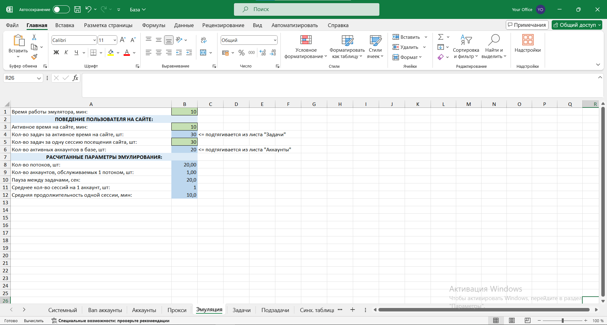

---
layout:
  title:
    visible: true
  description:
    visible: false
  tableOfContents:
    visible: true
  outline:
    visible: true
  pagination:
    visible: true
---

# Эмулятор

Враг любого арбитражника — это анти-спам/фрод системы, которые могут налету выносить точные автоматические решения о естественности поведения аккаунта. Всякая новая автоматическая система рано или поздно обречена на знакомство с фильтрами целевого сайта.

В чем же проблема привычных софтов для продвижения? Правильный ответ: в однотипности выполнения рабочих задач. Да такой однотипности, которую зачастую уж точно нельзя назвать естественной. Ведь и правда, какой аккаунт сразу после регистрации или совершенно внезапно начинает однотипно заваливать сотнями лайков незнакомых ему людей или ни с того ни с сего добавлять в друзья десятки новых юзеров. Да не просто лайкать и не просто добавлять, а делать всё это с неимоверной частотой и постоянно утыкаться в верхние дневные лимиты… Просто необходимо быть внимательнее к ответам системы, постоянно оценивать и сравнивать своё поведение с поведением среднестатистического пользователя, делать его более разнообразным и чуть менее предсказуемым. И только в этом случае вам удастся сохранить свою базу и обойти строгие автофильтры.&#x20;

**Эмулятор жизнедеятельности аккаунтов в ezFERM** — это полноценная имитация разнообразной непредсказуемой жизни рядового пользователя, но со смещением фокуса на нужные вам целевые действия. Фокусирование задаётся настройками, о которых речь пойдёт немного позже. Сейчас главное понять, что этот основополагающий принцип позволяет ускользнуть от чуткого взора автофильтров, разогреть аккаунт, пройти так называемую песочницу и вывести бота «в люди». Именно для обхода автоматических фильтров целевых сайтов и был разработан эмулятор жизнедеятельности аккаунтов.

Для того чтобы задать параметры эмуляции, о которых речь пойдёт далее, необходимо разобраться с тем, как работает эмулятор и как получается так, что Zennoposter версии Standard, рассчитанный всего на 5 потоков, может без проблем обслуживать базу из 50–70 аккаунтов. У многих опытных пользователей, которым довелось поработать с немалым количеством прочего софта для соц. сетей, возникает вполне логичный вопрос: «Что за странная арифметика? Во всех программах, которыми я пользовался ранее, количество потоков соответствует количеству аккаунтов. Поток берёт аккаунт и крутит его до посинения…». А ответ на самом деле на поверхности. Достаточно проиллюстрировать суточный результат работы обычной программы и эмулятора, и вам сразу всё станет понятно:

<figure><figcaption></figcaption></figure>

Именно для того, чтобы обеспечить подобную динамику и при этом исключить простои в работе потоков и была переосмыслена логика. Теперь поток не завершает свою работу и не встаёт на паузу, как только закончил эмуляцию одного аккаунта, а тут же берёт следующий, затем следующий и т. д. При этом один аккаунт единовременно может эмулироваться строго одним потоком, а у только что отработанных аккаунтов появляется время на отдых, и получается, что поток не выжимает все соки из одного акка, а планомерно «вгрызается» в базу, обеспечивая случайный среднесуточный график активности каждого бота.

## <mark style="color:blue;">Параметры эмуляции</mark>



<figure><figcaption></figcaption></figure>



<figure><figcaption></figcaption></figure>



Не забывайте про цвета ячеек. Вручную нужно заполнять только зеленые, синие заполнятся автоматически.&#x20;

### <mark style="color:blue;">**Время работы эмулятора**</mark>

Чем меньше время работы эмулятора, тем больше понадобится потоков, что бы выполнить работу всех аккаунтов, т.е. 1 поток успеет обработать меньше аккаунтов. И наоборот, чем больше время работы эмулятора, тем меньше понадобится потоков, что бы выполнить работу всех аккаунтов, т.е. 1 поток успеет обработать больше аккаунтов за время работы эмулятора.&#x20;

Это говорит о том, что если вам нужно быстро выполнить работу всеми аккаунтами, время работы эмулятора указывается меньше. Если торопиться некуда, и есть время, то лучше увеличить время.

Также, низкое время работы эмулятора тратит больше ресурсов процессора(потоков), а увеличение времени снижает потребляемые ресурсы.

**Время работы эмулятора -** в нашем случае это 16 часов или 960 минут. Так и запишем. Имейте в виду, что эмулятор может работать круглые сутки – 1440 минут, но тогда аккаунты будут выполнять работу ночью, что может не понравиться фильтрам целевого сайта.

### <mark style="color:blue;">Поведение пользователя на сайте</mark>

Что бы заполнить поведение пользователя на сайте, мы начинаем примерять на нашего бота поведение человека (когда говорится "Человек" или "Пользователь" имеется в виду "Бот"):

* _**Активное время на сайте**_ – сколько часов/минут человек проводит на сайте. Скажем, наш человек(бот) провел на сайте 4 часа или 240 мин. из 16 часов бодрствования. Записываем.
* _**Кол-во задач за активное время на сайте, шт.**_ – сколько различных действий/задач человек совершил/совершит за время активной работы на сайте. Данное поле заполняется по формуле. Формула обращается на лист “Задачи” и получает сумму всех раз выполнений задач. Как вы могли понять, задачи мы планируем заранее. В нашем случае имеем 3 задачи и 30 выполнений в сумме.
* _**Кол-во задач за одну сессию посещения сайта, шт.**_ – активное время на сайте человек проводит ни за один раз, а сессионно, и в каждой сессии делает действия/задачи. Предположим, из 30 выполнений заданий 5 за одну сессию.
* _**Кол-во активных аккаунтов в базе, шт.**_ – формула обращается на лист “Аккаунты” и считает количество активных аккаунтов (все кроме Ban, Off и Support).

### <mark style="color:blue;">Рассчитанные параметры эмулирования</mark>

В результате мы можем видеть рассчитанные параметры эмуляции, чтобы выполнить данную эмуляцию:

* _**Кол-во потоков, шт.**_ – количество потоков, необходимых для полного выполнения работы со всеми аккаунтами за общее время работы эмулятора.
* _**Кол-во аккаунтов, обслуживаемых 1 потоком, шт.**_ – так как в нашей системе поток никогда не простаивает, за исключением паузы между задачами, то после окончания сессии работы с аккаунтом, поток не ждет, пока нужно будет выполнять следующую сессию, а переключается на другой аккаунт и начинает выполнять его сессию. Поэтому, поток может работать с несколькими аккаунтами.
* _**Пауза между задачами, сек**_ – сессия состоит из задач, между которыми пауза. Это ОЧЕНЬ важный параметр, так как пауза между задачами средняя, и меняется от того, сколько времени занимает выполнение задачи. Каждая секунда выполнения задачи, вычитается из паузы между задачами. Что очень важно иметь в виду, что задачи не должны быть долгими в выполнении, в случае если длительность задачи будет больше паузы между задачами, то паузы не будет. К примеру, время выполнения вашей задачи в среднем 10 сек, а пауза 30 сек, то реальная пауза будет 20 сек. Сделано это для того, чтобы долгие задачи не увеличивали время общей эмуляции аккаунта, и так же, паузы становятся более рандомными. Но, если ваша задача будет 40 секунд, а пауза 30, то пауза будет -10 сек, то есть паузы не будет вообще, а общее время эмулирования всех аккаунтов увеличится на 10 сек.&#x20;
* _**Среднее кол-во активных аккаунтов в базе, шт.**_ – сколько сессий посещения сайта будет выполнено за общее время посещения сайта.
* _**Средняя продолжительность одной сессии, мин**_ – сколько времени бот будет проводить времени на сайте за одну сессию.

### <mark style="color:blue;">Готово.</mark>&#x20;

Теперь наш бот будет похож по своему поведению на рядового пользователя.


* Можно настроить работу 1 поток на 1 аккаунт, требуется только, чтобы “Общее время посещения сайта равнялось “Активное время на сайте”, но тогда потоки могут работать не эффективно и много “спать”.
* Чтобы отрегулировать “Пауза между задачами”, изменяйте “Активное время на сайте” и “ Кол-во задач за активное время на сайте”.
* Чтобы отрегулировать “Среднее количество сессий на 1 аккаунт”, изменяйте “ Кол-во задач за одну сессию посещения сайта”.

