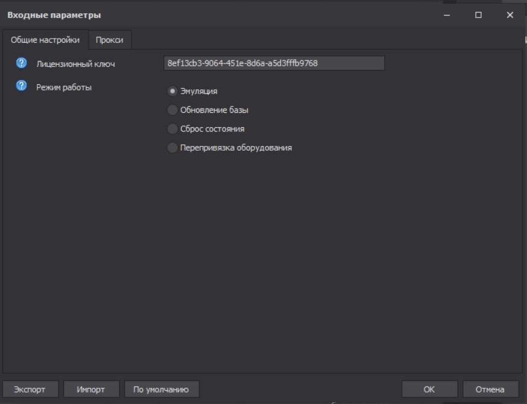

---
layout:
  title:
    visible: true
  description:
    visible: false
  tableOfContents:
    visible: true
  outline:
    visible: true
  pagination:
    visible: true
---

# Синхронизированные таблицы



<figure><figcaption></figcaption></figure>



<figure><figcaption></figcaption></figure>



<figure><figcaption></figcaption></figure>



Программа работает с профилями zpprofile. Каждому профилю отводится строка в Базе на листе “Аккаунты”. Столбцы базы несут информацию только о состоянии эмуляции, но вашему проекту может понадобиться вести дополнительные столбцы с данными для каждого аккаунта. К примеру, задачи вашего проекта требуют хранение данных о лайках, комментариях, использованной капчи и другой информации, но вы не можете создать эти столбцы в базе, так как модификация файла “База.xlsx” запрещена. Для этой задачи вам нужны таблицы, в которых всегда будет столбец A, c актуальными именами аккаунтов, имеющихся в системном файле База на листе “Аккаунты”. В начале старта эмуляции, или в режиме “Обновление базы”, если синхронизированные таблицы включены, произойдет удаление строк с аккаунтами, имеющихся в ваших таблицах и отсутствующих в Базе аккаунтов, и добавление новых строк с аккаунтами, которые есть в Базе, но отсутствуют в ваших таблицах.


* Синхронизированные таблицы не обязательны. Их можно отключить во входных настройках PM.&#x20;


## <mark style="color:blue;">Столбцы</mark>

“Имя таблицы” – название синхронизированной таблицы без расширения.
