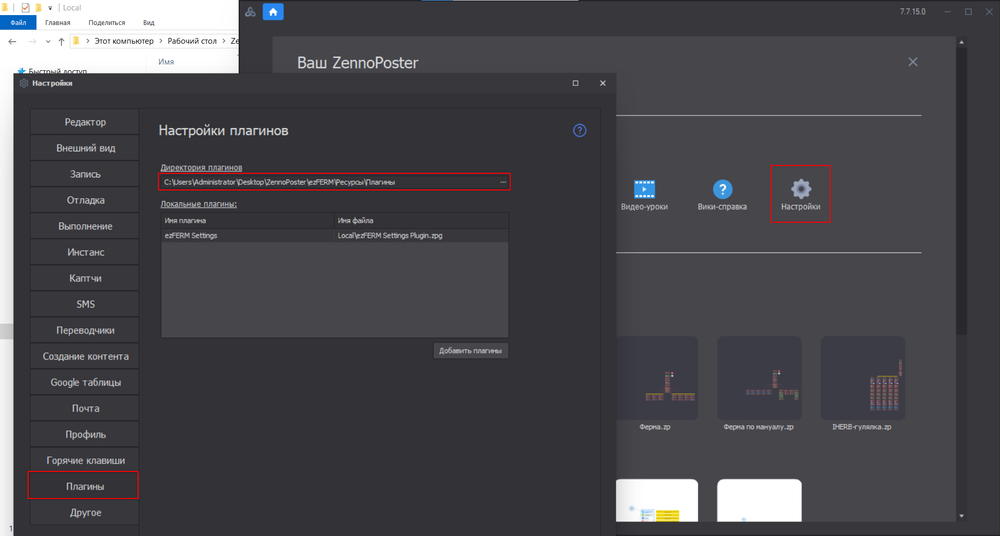

---
layout:
  title:
    visible: true
  description:
    visible: false
  tableOfContents:
    visible: true
  outline:
    visible: true
  pagination:
    visible: true
---

# Установка ezFERM

## <mark style="color:blue;">Устанавливаем ZennoPoster</mark>

Для использования ezFERM нужен ZennoPoster Lite, Standart или Professional. Также можно бесплатный ZennoPoster Demo, но будет работать 14 дней.


ezFERM не выдается на ZennoBox.




## <mark style="color:blue;">Загружаем инсталлятор</mark>



## <mark style="color:blue;">Готовим Windows</mark>

Перед установкой ezFERM стоит обновить win чтобы не было проблем с установкой.

<figure><figcaption></figcaption></figure>

## <mark style="color:blue;">Устанавливаем</mark>

Открываем Installer.exe от имени Администратора.


Если возникает ошибка отсутствия .net framework 4.8.1, то загружаем Runtime

[https://dotnet.microsoft.com/ru-ru/download/dotnet-framework/net481](https://dotnet.microsoft.com/ru-ru/download/dotnet-framework/net481)


<figure><figcaption></figcaption></figure>

Указываем директорию установки и загружаем.

<figure><figcaption></figcaption></figure>

Инсталлятор не удаляем, в будущем нужен для получения обновлений.

## <mark style="color:blue;">Настраиваем ZennoPoster</mark>

После установки важно установить директорию плагинов в ProjectMaker как на скрине, иначе фермы работать не будут. Плагины должны добавиться автоматически.

<figure><figcaption></figcaption></figure>

## <mark style="color:blue;">Готово</mark>

Спасибо, что установили ezFERM.
